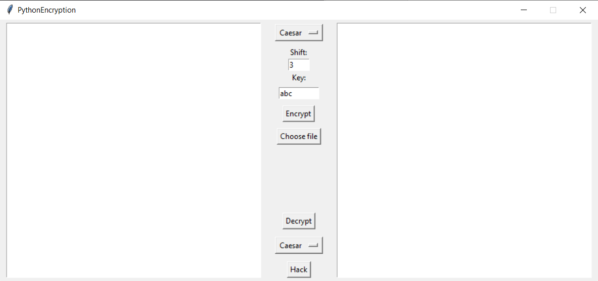
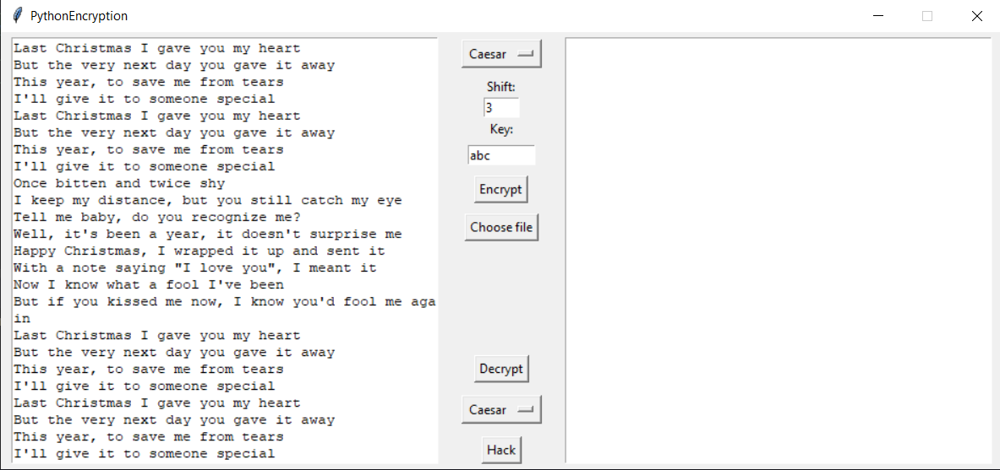
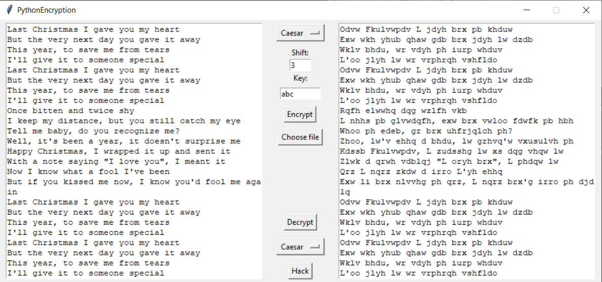

# Python_encryption_project
## Установка
Склонировать репозиторий. Запустить программу при помощи команды
```bash
$> python3 main.py
```

## Работа с программой

- При запуске программы отображается окно для шифрования или дешифрования текста. 
- Вы можете написать текст в левое поле для ввода для шифрования и в правое для дешифрования


- Можно выбрать режим работы(Caesar, Vigenere, Vernam), а также сдвиг для шифра Цезаря и ключ для шифров Виженера и Вернама
- По умолчанию сдвиг равен 3 и ключ - "abc"
- После нажатия "Encrypt" в правом окне появится зашифрованный текст



- Аналогично для дешифрования
- Также можно выбрать файл для шифрования, кнопка "Choose file"
- Кнопка "Hack" для автоматического взлома шифра Цезаря методами частотного анализа
